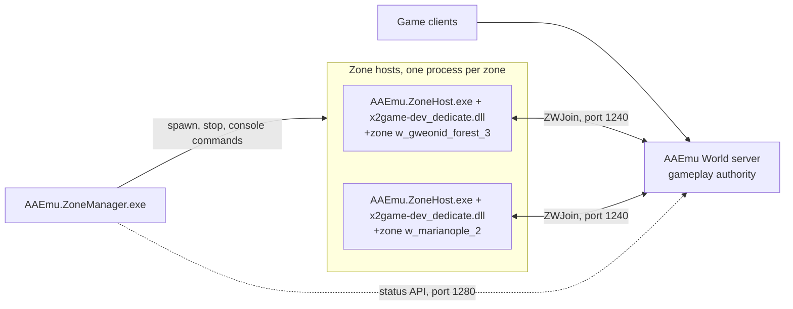

# AAEmu Zone Host


A replacement zone-server bootstrap for ArcheAge 10.0.2.13, and the Windows application that runs it.

## What this is

ArcheAge splits its server into a world server that owns gameplay state and a set of zone
processes that run the native simulation for one map each. The stock zone process is
`dedicatedserver.exe`, a bootstrap of about one function whose whole job is to load
`x2game-dev_dedicate.dll`, fill in a startup structure, and call into it.

This repository replaces that bootstrap and builds the operator tooling around it.
`AAEmu.ZoneHost.exe` does what `dedicatedserver.exe` does, with the parts a server operator
actually needs to change made configurable. `AAEmu.ZoneManager.exe` starts those processes,
watches them, and can start and stop zones by itself as players move around the map.

Neither program is a server on its own. Both attach to an [AAEmu](https://github.com/AAEmu/AAEmu)
World server, which owns gameplay authority and tells each zone what to simulate.

| Project | What it is |
| --- | --- |
| [`AAEmu.ZoneHost.Native`](AAEmu.ZoneHost.Native/) | The bootstrap. A Rust executable with no third-party crates that reproduces the original startup ABI, loads the native zone DLL, and keeps one zone running. Builds to `AAEmu.ZoneHost.exe`. |
| [`AAEmu.ZoneManager`](AAEmu.ZoneManager/) | A WPF desktop application that launches and supervises zone hosts, with zone selection on the real client map, native console access, live logs, and World status. |



## Features

Zone Manager reads the zone list from the decrypted client database and the bundled zone catalog,
then draws the selected zone group's own map so you pick a zone by looking at it. Zone boundaries
come from the same 64 metre `world.xml` sector assignments the World server uses, so an irregular
map like Gweonid, split across three zones, is drawn as it really is rather than approximated by a
bounding box.

Each running zone gets its own process, its own log file, and its own panel. Start, stop and
restart are per zone, so one crashed map does not take the others with it.

**Automatic zone management.** Turn it on and the manager hosts zones based on where players
actually are. A zone is wanted when a player stands in it, when a player is within a configurable
distance of its border, or when it is one of the configured anchor zones. Zones leave that set
only after staying unwanted for an idle timeout, so a player pacing back and forth over a border
does not cycle a host process. Four anchor templates ship: a single default zone, whatever zones
have players in them, the six starting maps for the playable races, or follow one named character.
A ceiling caps how many zones run at once.

**Native console access.** Select a running zone and the manager asks that host to dump CrySystem's
own command and variable catalog, so the list you browse is what the loaded DLL actually exposes,
with its real help text, rather than a hand-maintained copy that drifts. Commands go to the zone as
Windows console input records, because CrySystem's console reads `ReadConsoleInputA` and ignores
redirected stdin. Commands that look destructive ask for confirmation first.

**World status.** The header polls World's read-only status endpoint every two seconds and reports
whether World is reachable, who is online and in which zone, and how far each zone got through the
`Connected` to `Joined` to `ZoneLoaded` handshake. The player list comes from World's live character
registry, so it is not guesswork from the character database.

Logs tail into an expandable live view and persist per zone on disk.

## Requirements

Windows x64 only. The host calls the Win32 API directly and the manager is WPF.

To run:

- An ArcheAge 10.0.2.13 installation, which supplies `x2game-dev_dedicate.dll`, the `game_pak`, and
  a decrypted game database. None of that is distributed here.
- An AAEmu World server listening on port `1240`, with its status API on `1280`.
- An extracted client `map` directory if you want the map view.

To build:

- .NET 10 SDK for Zone Manager.
- Rust stable `x86_64-pc-windows-msvc` for the host, plus Visual Studio 2022 or Build Tools 2022
  with **Desktop development with C++** and a Windows 10 or 11 SDK. The GNU Rust target does not
  work here.

## Build

Zone Manager builds with the SDK alone:

```powershell
dotnet build .\AAEmu.ZoneHost.slnx -c Release
```

The native host needs the MSVC toolchain, so build it from the **x64 Native Tools Command Prompt
for Visual Studio**. Keep Cargo output outside the working tree:

```powershell
$env:CARGO_TARGET_DIR = 'C:\AAEmuRuntime\ZoneHostBuild'
cargo +stable-x86_64-pc-windows-msvc build --locked `
  --manifest-path .\AAEmu.ZoneHost.Native\Cargo.toml `
  --release --target x86_64-pc-windows-msvc
```

Cargo names the binary `aaemu-zone-host.exe` after the `[[bin]]` entry. Copy it beside
`x2game-dev_dedicate.dll` under the name `AAEmu.ZoneHost.exe`, which is what Zone Manager looks for:

```powershell
Copy-Item C:\AAEmuRuntime\ZoneHostBuild\x86_64-pc-windows-msvc\release\aaemu-zone-host.exe `
          C:\AA\Bin64\AAEmu.ZoneHost.exe
```

Where the executable sits matters. `XlSetWorkingDir(true)` derives the ArcheAge game root from the
executable's own location, so running it out of Cargo's target directory sends native startup
looking for `game`, `game_pak`, and the database next to that directory.

Prerequisites, hash verification, and a troubleshooting table for the usual `link.exe`,
`msvcrt.lib` and `kernel32.lib` failures are in
[`AAEmu.ZoneHost.Native/README.md`](AAEmu.ZoneHost.Native/README.md#build-aaemuzonehostexe).

## Running a zone

Through Zone Manager:

1. Start MySQL, Login, and World. World must be listening on port `1240`.
2. Start `AAEmu.ZoneManager.exe`.
3. Point it at `AAEmu.ZoneHost.exe` and `x2game-dev_dedicate.dll`, then select a decrypted game
   database and the extracted client `map` directory. There is no default database path, so the
   first launch asks for one.
4. Pick a zone and click **Launch zone**.

Or drive the host directly, which is what the manager does under the hood:

```powershell
Set-Location C:\AA\Bin64
$env:AAEMU_ZONE_DLL = 'C:\AA\Bin64\x2game-dev_dedicate.dll'
$env:AAEMU_ZONE_SAVE_DIR = 'C:\AAEmuRuntime\ZoneManager\Logs\182-w_gweonid_forest_3'
$env:AAEMU_ZONE_LOG_NAME = 'ArcheAge-182.log'

.\AAEmu.ZoneHost.exe -dedicated `
  +world_ip 127.0.0.1 +world_port 1240 `
  +world_serveraddr 127.0.0.1 +world_serverport 1240 `
  +zone w_gweonid_forest_3 +sv_map w_gweonid_forest_3 `
  +db_location game/db/game_decrypted.sqlite3
```

Killing that process takes its zone offline.

## Configuration

### Zone host

The host takes its own settings from the environment and passes every command-line argument
through to native startup untouched. Zone Manager uses this mode.

| Variable | Required | Default | Purpose |
| --- | --- | --- | --- |
| `AAEMU_ZONE_SAVE_DIR` | yes | none | Save and log directory, replacing the original `Documents` junction |
| `AAEMU_ZONE_DLL` | no | `x2game-dev_dedicate.dll` beside the executable | Native zone DLL to load |
| `AAEMU_ZONE_LOG_NAME` | no | `ArcheAge.log` | Log file name inside the save directory |

When you cannot set environment variables, pass the same three settings as flags. This mode
switches on only when `--aaemu-zone-host` is the first argument, and everything after `--` goes to
native startup:

```text
AAEmu.ZoneHost.exe --aaemu-zone-host --native-dll <path> --native-save-dir <dir>
                   [--native-log-name <name>] -- <native arguments>
```

Zone Manager also signals `Local\AAEmu.ZoneHost.ConsoleCatalog.<pid>` to make a host write
`consolecommandsandvars.txt` in its working directory. The host verifies the exported `Prompt`
function RVA before making that internal call and refuses it on a CrySystem build it does not
recognise.

### Zone manager

Everything is editable in the UI and stored in `C:\AAEmuRuntime\ZoneManager\settings.json`. Notable
defaults:

| Setting | Default |
| --- | --- |
| Host executable | `C:\AA\Bin64\AAEmu.ZoneHost.exe` |
| Native zone DLL and working directory | `C:\AA\Bin64` |
| World endpoint | `127.0.0.1:1240` |
| World status API | `127.0.0.1:1280` |
| Game database | `+db_location game/db/game_decrypted.sqlite3` |
| Locale | `zh_cn` |
| Runtime root | `C:\AAEmuRuntime\ZoneManager` |

The manager builds the native command line from the verified switches (`-dedicated`, `-devmode`,
`-fulldump`) and the zone launch CVars, including rendering (`e_render`, `r_Driver`), NPC movement
and AI skips, and log verbosity. Anything else you type into **Extra arguments** passes through
unchanged.

Settings, per-zone logs, map assets, and the generated console catalog all live under the runtime
root, outside the working tree. Client map images are never stored in the repository or the
published application. The manager reads them from the extracted client tree you select, resolving
each base texture as `map_resources\<folder_name>\<locale>\world.dds` and falling back to `en_us`
and then the unlocalised asset.

## Native parity

The entire non-CRT bootstrap in the CN 10.0.2.13 `dedicatedserver.exe` is one function,
`FUN_140001000` at `0x140001000`. Ghidra analysis of it drove this replacement, which mirrors its
observable startup ABI:

| Original | AAEmu Zone Host |
| --- | --- |
| Copies the complete command line into startup offset `0x40`, capacity `0x800` | Rebuilds the complete quoted command line into the same field and rejects overflow |
| Reads the first save-directory `devmode.cfg` line when it contains `-devmode` | Appends that line before checking the default zone |
| Adds `+zone w_gweonid_forest_1` when no case-insensitive `+zone` substring exists | Same fallback, though Zone Manager normally supplies the zone |
| Passes `lastWriteFileTime + fileSize` for `game_pak` at offset `0x9A0` | Computes the same wrapping 64-bit value |
| Calls startup vtable slots `0`, `6` and `1`, and game vtable slot `8` | Same initialize, shutdown, release and run slots |
| Cleans the exception handler and unloads x2game after startup release | Scoped guards keep that order on both success and error paths |

The startup block also matches the original values at offsets `0x940`, `0x948`, `0x950`, `0x960`,
`0x970`, `0x977..0x980` and `0x9AC`.

Four things are deliberate additions rather than original behaviour: the configurable DLL path, the
explicit external save directory in place of the `Documents` junction, a nonzero fatal exit code,
and the hidden console the manager injects commands through.

## Project layout

```text
AAEmu.ZoneHost.Native/     Rust bootstrap, no third-party crates
  src/main.rs              Startup ABI, option parsing, patches, console catalog
AAEmu.ZoneManager/
  Models/                  Settings, zone and status records
  Services/                Zone catalog, map assets, process control, console, World status, auto-zone
  BundledData/             Zone catalog and world.xml sector assignments
```

## License

GPL, matching upstream AAEmu. See [LICENSE](LICENSE).
